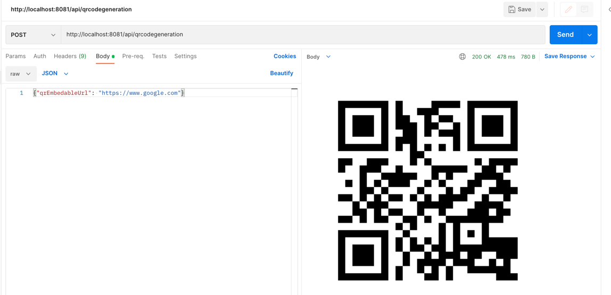
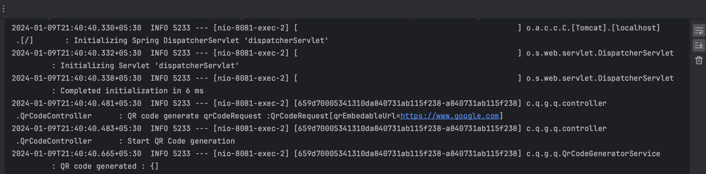

This application about 
QR Code generator and micrometer Logging correlation  
using Java 17 , Springboot 3.2.1

``` 
mvn spring-boot:run

```

```curl --location --request POST 'http://localhost:8081/api/qrcodegeneration' \
--header 'Content-Type: application/json' \
--data-raw '{"qrEmbedableUrl": "https://www.google.com"}'
```
### screen shot for QR CODE request and response


### screen shot for micrometer logging correlation ID

